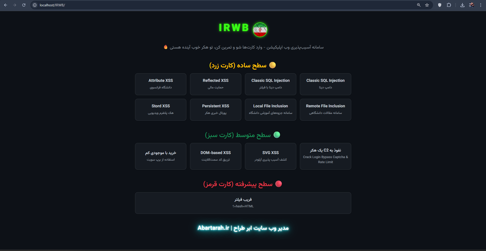
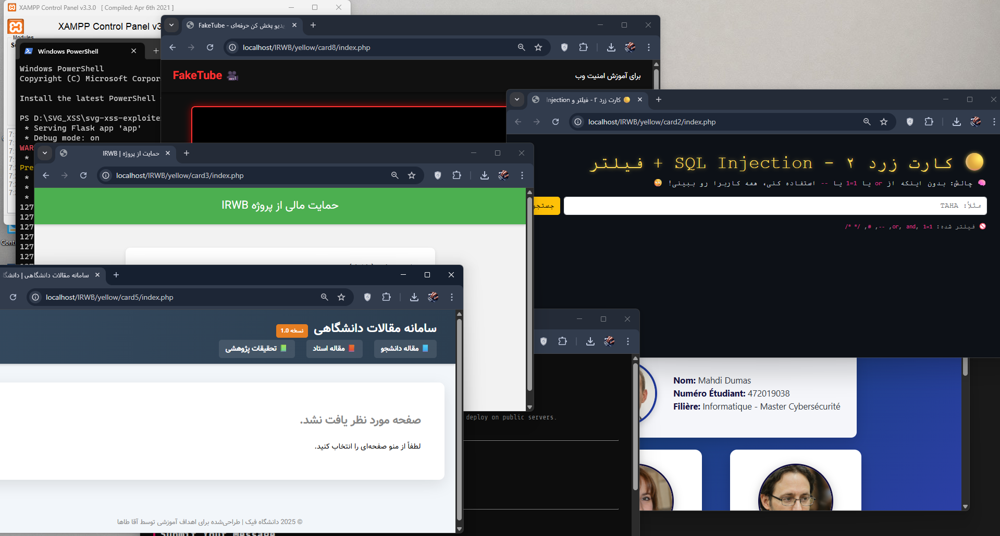

# IRWB - سامانه جامع آموزش امنیت وب اپلیکیشن‌ها 🚀



**IRWB** یک پلتفرم کامل و تخصصی برای آموزش عملی **آسیب‌پذیری‌های وب اپلیکیشن** به زبان فارسی است. این پروژه مناسب هکرهای کلاه سفید، متخصصان امنیت و توسعه‌دهندگانی است که می‌خواهند مهارت‌های خود را در زمینه تست نفوذ وب به صورت تعاملی و حرفه‌ای ارتقا دهند.

---

## 🎯 اهداف پروژه

- آموزش جامع و گام به گام آسیب‌پذیری‌های رایج وب مانند:
  - SQL Injection
  - Cross-Site Scripting (XSS) (از جمله Reflected، Stored و DOM-based)
  - SVG XSS
  - Remote و Local File Inclusion
  - دور زدن فیلترها و فریب محدودیت‌ها (Filter Bypass)
- فراهم کردن محیط تمرینی امن، کاربردی و کاربرپسند
- توسعه مهارت‌های عملی در تست نفوذ و امنیت برنامه‌های تحت وب
- کمک به افزایش آگاهی و تخصص جامعه امنیت اطلاعات فارسی‌زبان

---
## نمایی کوچک

## 🃏 چالش‌ها و کارت‌های تمرینی موجود

### 🟡 سطح ساده (کارت زرد)
- Classic SQL Injection (دامپ دیتا)
- Classic SQL Injection با فیلتر (دامپ دیتا با فیلتر)
- Reflected XSS (حمایت مالی)
- Attribute XSS (دانشگاه فرانسوی)
- Remote File Inclusion (سامانه مقالات دانشگاهی)
- Local File Inclusion (سامانه جزوه‌های آموزشی دانشگاه)
- Persistent & Stored XSS (پورتال خبری هکر، هک پلتفرم ویدیویی)

### 🟢 سطح متوسط (کارت سبز)
- نفوذ به C2 یک هکر  
- Crack Login Bypass Captcha & Rate Limit  
- SVG XSS (کشف آسیب‌پذیری آپلودر)  
- DOM-based XSS (تزریق کد سمت کلاینت)  
- خرید با موجودی کم  
- استفاده از ابزار Burp Suite  

### 🔴 سطح پیشرفته (کارت قرمز)
- فریب فیلتر (Filter Bypass پیچیده)  
- ترکیب hash + HTML = ؟  

---

## 🚀 ویژگی‌های کلیدی

- کارت‌های تمرینی در سه سطح با چالش‌های واقعی و کاربردی  
- طراحی واکنش‌گرا و زیبا با Bootstrap 5 (نسخه RTL)  
- استفاده از فونت‌های فارسی Vazirmatn و فونت برنامه‌نویسی Fira Code برای تجربه بهتر کاربر  
- ترمینال تعاملی برای اجرای دستورات و شبیه‌سازی حملات واقعی  
- محیط ایزوله و امن برای آپلود و بررسی فایل‌های SVG  
- قابلیت دانلود خروجی‌های تولید شده  
- ساختار منعطف برای افزودن چالش‌ها و آپدیت آسان  
- کاملاً متن باز با امکان مشارکت جامعه  

---
## License

This project is licensed under the MIT License - see the [LICENSE](./LICENSE) file for details.

© 2025 Taha Hatami — [GitHub](https://github.com/TahaHatami)
---
## 📦 نحوه استفاده

```bash
git clone https://github.com/TahaHatami/IRWB.git
cd IRWB
# پروژه را در ریشه وب‌سرور محلی یا هاست قرار دهید (مثل XAMPP, WAMP, LAMP)
# آدرس پروژه را در مرورگر باز کنید و تمرین را شروع کنید
